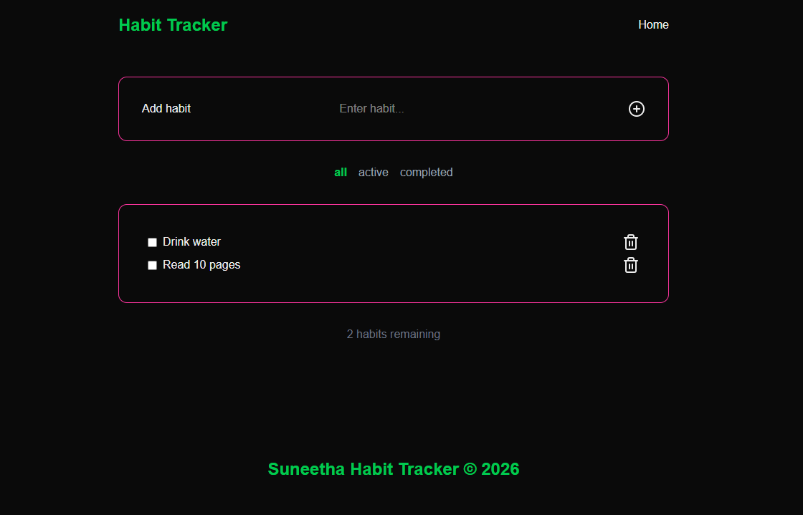
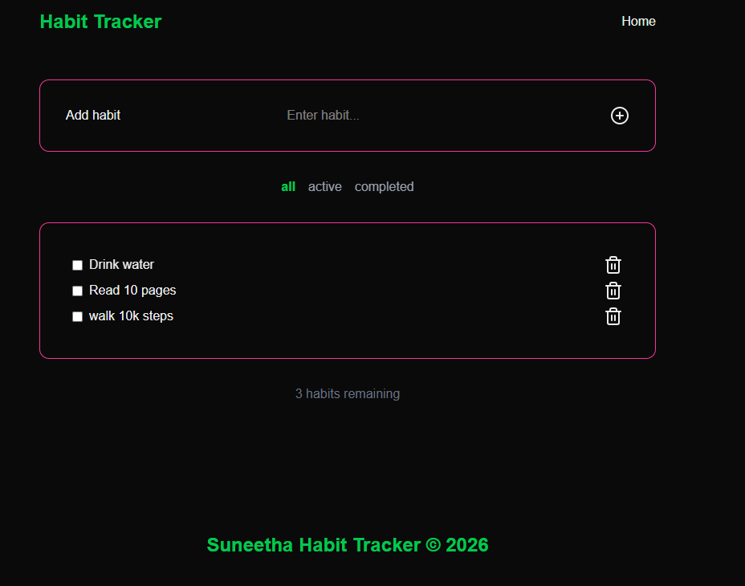
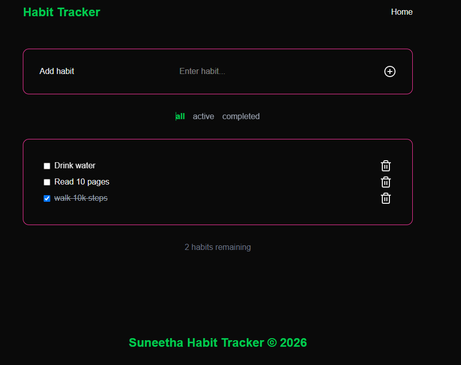
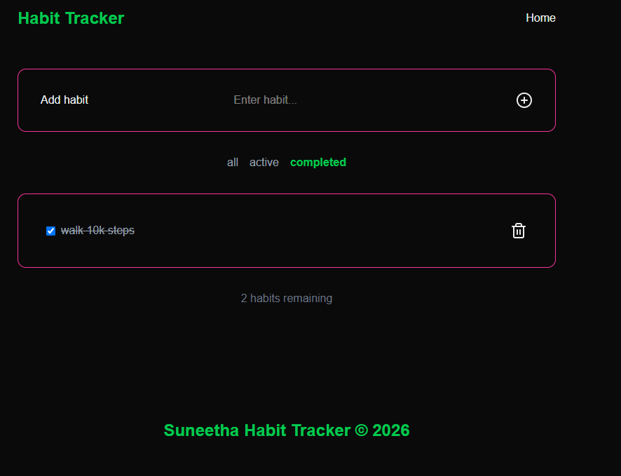
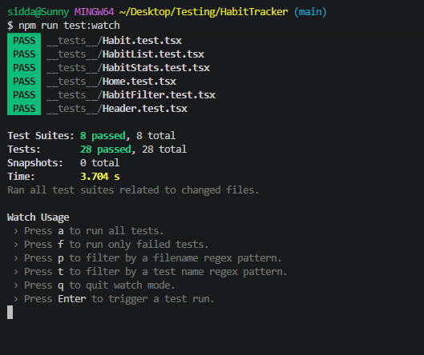

# Habit Tracker

A simple habit tracking web app built with Next.js, TypeScript, and Tailwind CSS.

## What it does

- Add a new habit to track
- Mark a habit as done for the day
- Filter habits by All / Active / Completed
- Remove a habit from the list
- See how many habits are still left to complete

## Components

The application contains the following components:

- **Header** — page title and navigation
- **Footer** — footer text
- **AddHabit** — input and button to add a new habit
- **Habit** — a single habit with a checkbox and delete button
- **HabitList** — displays all habits
- **HabitStats** — shows how many habits are still remaining
- **HabitFilter** — buttons to filter by all / active / completed

## How it works

The `Home` page holds all the habit data and passes it down to each component as props.
When a habit is added, completed, or removed, `Home` updates the state, and the page
re-renders automatically to reflect the change.

## Screenshots

### Habit Tracker — Home view

### Adding a habit

### Completed habit

### Filtered view

## Tests

All tests are in the `__tests__` folder.

### Unit Tests

- Header
- Footer
- AddHabit
- Habit
- HabitList
- HabitFilter
- HabitStats

24 unit tests — each component tested on its own with mock data

### Integration Tests

- Add habit
- Mark habit as completed
- Remove habit
- Filter habits (all / active / completed)

4 integration tests — testing the full page.

Total: 28 Tests

### Tests Passed

## To run the tests:

npm run test:watch

npm run dev

Git repo link : https://github.com/SuneethaBandaru/HabitTracker

Vercel live link : https://habit-tracker-beige-eight.vercel.app/
